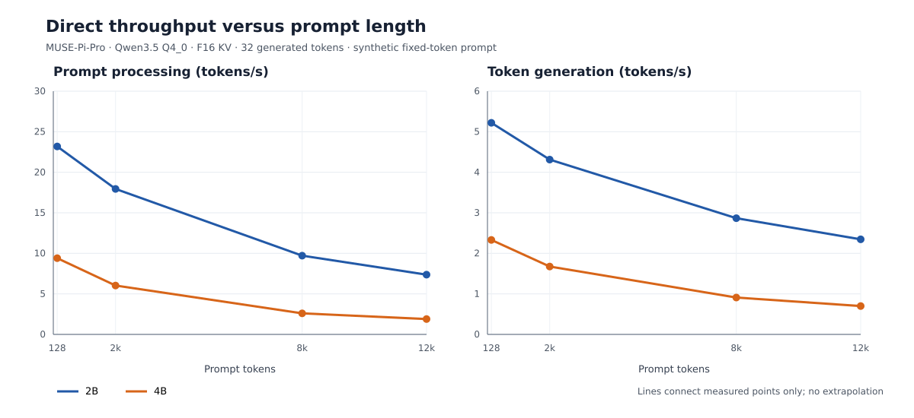

# Qwen3.5 2B/4B inference lifecycle on MUSE-Pi-Pro

> Dated campaign snapshot. Measurements apply to the stated workload and date.
> Queued/running statements below are historical; use the
> [current guide](../DOCS.md) and the [reports index](README.md) for later results and current status.

Date: 2026-09-25. Board: `musepipro-wg`, SpaceMiT K1/X60, Bianbu 2.3.5, 16 GiB RAM. Source: official SpaceMiT llama.cpp fork with packaged project patches, isolated integrated checkout at `a990751`. The TCM library was first in `LD_LIBRARY_PATH`; the server log confirms `is_fake_tcm: 0`, `use_ime1: 1`. CPU governor was `performance`, current frequency 1.6 GHz, and thermal zones were 39–41 °C during the first sweep. All eight harts identify as X60, but only cores 0–3 advertise the IME extension; the SpaceMiT runtime selects these four as its preferred `cpu_mask: f` group.

**Campaign completion audit (2026-09-27):** [completed board gates](2026-09-27-completed-gates.md) supersede the queued-status statements in the chronological campaign notes below. The integrated board checkout now contains the opt-in 256-bit RVV attention patch; use `SPINE_FA_WIDE_TILE=1` with these Qwen3.5 F16-KV models.

## Method

The [lifecycle runner](../bench/bench-lifecycle.py) sends a fixed token-ID prompt through the local loopback `/completion` streaming API. Unless a row states otherwise: four server threads, Q4_0 weights and draft head, flash attention, batch/ubatch 32, greedy seed 42, prompt cache disabled, one slot, F16 K/V, and a 16,384-token context. The reported time to first token (TTFT) is client-observed from request start to the first content-bearing stream event. Prompt and decode rates come from the server's final timings. `VmRSS` is sampled every 0.2 seconds, including model pages and runtime buffers. Later runs also sample system `MemAvailable` at the same interval. Prompt IDs repeat a tokenized sentence to hold token count constant; this is a hardware stress test, not a natural-document quality test.

## Initial direct-decoding baseline

| Model | Prompt tokens | TTFT (s) | Prompt (tok/s) | Decode (tok/s) | Peak RSS (MiB) |
| --- | ---: | ---: | ---: | ---: | ---: |
| 2B | 128 | 5.52 | 23.19 | 5.22 | 2520 |
| 2B | 2048 | 114.25 | 17.94 | 4.31 | 2580 |
| 2B | 8192 | 843.69 | 9.71 | 2.87 | 2584 |
| 2B | 12288 | 1667.24 | 7.37 | 2.34 | 2585 |
| 4B | 128 | 13.62 | 9.40 | 2.33 | 5470 |
| 4B | 2048 | 340.02 | 6.03 | 1.67 | 5626 |
| 4B | 8192 | 3158.88 | 2.59 | 0.91 | 5627 |
| 4B | 12288 | 6487.11 | 1.89 | 0.70 | 5628 |

The [measured context curves](raw/2026-09-25-lifecycle/context-curves.svg) connect completed direct-decoding points through 12,288 tokens for both models. The figure is generated from the archived JSONL by [plot-context-curves.py](../bench/plot-context-curves.py).

GGUF metadata reports full attention every fourth main-model layer: six attention layers for 2B (24 main blocks) and eight for 4B (32 main blocks). F16 K+V therefore requires 12,288 bytes per token for 2B and 32,768 for 4B, or 192 MiB and 512 MiB at a 16k-token cache, before the separate MTP draft cache and allocator/runtime overhead. Q8_0 and Q4_0 cache formats can reduce this component, but the board has 16 GiB RAM and quantized attention may cost compute. The completed short-context A/B results below measure the compute and memory tradeoff; a repeated 4B comparison is still required before adoption.

The following figures are tensor-payload estimates for a 16,384-token target KV cache, using the GGUF attention-layer counts and 32-element quantization blocks. They exclude allocator padding, recurrent state, graph buffers, model mappings, and any MTP draft cache; the measured whole-process effects are reported below.

| K/V format | Bytes per 32 values | 2B target KV | 4B target KV | Reduction versus F16 |
| --- | ---: | ---: | ---: | ---: |
| F16 | 64 | 192 MiB | 512 MiB | baseline |
| Q8_0 | 34 | 102 MiB | 272 MiB | 46.9% |
| Q4_0 | 18 | 54 MiB | 144 MiB | 71.9% |

A live [4B F16 process snapshot](raw/2026-09-25-lifecycle/f16-4b-process-snapshot.txt) during 12k prefill reports `VmSize` 7,010,136 kB, `VmRSS` 5,660,016 kB, and no swap. This is a full-process observation, not an isolated KV measurement. Later cache-format records capture `VmSize` after server load and after each request as well as RSS. The [memory summary tool](../bench/summarize-memory.py) reports these whole-process metrics side by side.

The 2B 128-token TTFT differs from the older `llama-bench pp128` metric: it includes actual server handling and arrival of the first streamed token. Across the eight completed baseline rows, client TTFT exceeded the server-reported `prompt_ms` by 0.004–0.309 seconds. At the measured 2k–8k lengths, prefill therefore dominates first-token latency; reducing request transport alone cannot materially change these cold-prompt results. The 2,048- and 8,192-token results show substantial prefill and decode degradation as the attention history grows. At 8k, prompt throughput is 58% lower and direct decode is 45% lower than at 128 tokens. At 12k, those losses reach 68% and 55%; TTFT is 27.8 minutes for this cold synthetic prompt. Within the 8k request, RSS varied by 2.75 MiB and the 31 gaps between 32 streamed decode events had p99 374.6 ms with no gap over one second. At 12k, sampled RSS stayed exactly 2,584.65 MiB across 8,344 samples; the 31 stream-event gaps had p99 448.6 ms with none over one second. The 4B 8k cold prompt took 52.65 minutes to first token. Relative to its 128-token point, prompt rate fell 72% and direct decode rate fell 61%. The 8k request produced all 32 tokens at the limit with matching streamed/server counts and no error. Decode-phase RSS was flat across 174 samples. All 31 inter-token gaps exceeded one second, but were tightly clustered at 1,128–1,141 ms; first- and second-half stream rates were 0.882/0.881 tok/s. This is the expected slow token cadence, not evidence of an intermittent stall. These short decode samples are not long-duration stability proof. The completed 4B 12k cold prompt took 108.1 minutes to first token. Relative to 128 tokens, prompt throughput fell 79.9% and direct decode throughput fell 70.0%. All 32 tokens streamed at the limit with no error. Decode-phase RSS was constant across 227 samples, and the 31 inter-token gaps were tightly grouped around a slow 0.70-token/s cadence (p99 1,488.5 ms); no intermittent stall appeared. Whole-request RSS ranged 100.5 MiB as pages became resident during prefill. These short decode samples alone do not prove long-duration stability; the completed 2,048-token runs are analyzed below.

## Where prefill time grows

The server progress log reports elapsed prompt time after each 32-token microbatch. Averaging adjacent full 32-token batches within ±256 tokens of each context length gives:

| Model and completed request | Near 256 tokens (s/32) | Near 2k (s/32) | Near 8k (s/32) | Near 12k (s/32) |
| --- | ---: | ---: | ---: | ---: |
| 2B, 12k request | 1.46 | 2.25 | 5.41 | 7.24 |
| 4B, 8k request | 3.73 | 7.51 | 21.32 | — |
| 4B, 12k request | 3.73 | 7.49 | 21.54 | 30.68 |

The 4B batch time rose 5.7× between the 256-token and 8k neighborhoods and 8.2× by 12k; the 2B time rose 3.7×. Source inspection found that the SpaceMiT RVV flash-attention dispatcher accepts K/V head dimensions only up to 128, while both measured GGUFs use 256. The current F16 attention path therefore falls back to generic CPU attention for these heads; the isolated [wide tiled RVV candidate](../experiments/2026-09-26-wide-rvv-fa.md) tests this specific gap. This is an in-request comparison, so it avoids comparing different server launches, but it does not isolate which operation caused the growth. The result makes long-context prefill a separate optimization target from short-prompt batch overhead. Values are reproducible with [summarize-prefill-chunks.py](../bench/summarize-prefill-chunks.py) and the archived server logs; the 4B log is archived alongside the JSONL.

## Completed decode and scheduling comparisons

The forced 2,048-token runs finished at the token limit with no server errors. Direct and MTP token hashes match within each model. The repeated synthetic prompt yielded 100% acceptance of the logged MTP draft tokens; it is a favorable case for speculation, not evidence for arbitrary prose. Rate decreases as the generated context grows, and the 128-token windows make that expected drift visible.

| Model and mode | Wall time (s) | Decode (tok/s) | 128-token window min/median/max (tok/s) | Last versus first window | Decode RSS drift (MiB) | Max stream gap (ms) |
| --- | ---: | ---: | --- | ---: | ---: | ---: |
| 2B direct | 456.3 | 4.54 | 4.15 / 4.53 / 5.04 | −17.7% | +1.75 | 255 |
| 2B MTP | 269.6 | 7.76 | 6.50 / 7.64 / 9.43 | −31.0% | +5.13 | 1,020 |
| 4B direct | 1,114.7 | 1.86 | 1.61 / 1.86 / 2.24 | −28.4% | +0.50 | 636 |
| 4B MTP | 622.0 | 3.37 | 2.60 / 3.39 / 4.58 | −43.1% | +4.13 | 1,603 |

MTP raised average decode rate 70.8% for 2B and 81.1% for 4B on this prompt. All four long runs have 16 timing windows and bounded post-prefill RSS changes of 0.5–5.1 MiB. The larger MTP gap maxima reflect batched speculative delivery; the window-rate trend and exact token count show no unexplained stall in these single requests. The repeated-request soak has now completed for both model sizes and both modes; its rates, hashes, and memory are reported below. This is bounded multi-request stability evidence, not a claim of indefinite stability. Detailed traces are in [followup.jsonl](raw/2026-09-25-lifecycle/followup.jsonl) and reproducible with [summarize-stability.py](../bench/summarize-stability.py).

At 128 prompt tokens and 128 requested output tokens, 4B MTP improved single-request aggregate generation from 1.82 to 3.03 tok/s (+66.9%). At 2/4/8 concurrent requests, its aggregate throughput was 2.21/3.24/3.42 tok/s, versus 2.26/3.33/3.52 for direct decoding (2.1–2.6% lower). All 46 comparable 4B completions, including unified-KV variants, shared one token hash at this prompt and length. Single-stream speculation is beneficial here; the initial synthetic eight-stream data does not support enabling it at high concurrency. The completed fixed-code comparison below found the same high-concurrency throughput direction, with output variants across simultaneous requests. At eight 4B streams, the shared-cell `--kv-unified` scheduler gave 3.53 direct and 3.43 MTP aggregate tok/s, versus 3.52 and 3.42 with partitioned KV. Peak RSS differed by under 6 MiB per matched mode. This equal-length case shows no material scheduling gain. The first uneven-slot comparison is reported below; the two-round rotated reuse comparison is active.

Full-history MTP at 12k finished with 128 tokens for both models. Its cold-prompt TTFT was 1,844.8 s for 2B and 7,197.2 s for 4B, versus 1,667.2 s and 6,487.1 s for the 32-token direct baselines at the same prompt length. Prompt throughput fell about 10% in MTP mode; its decode rate was only 2.64/0.76 tok/s at 2B/4B. At these measured prefill and decode rates, full-history MTP is projected to lose end-to-end latency for a cold 12k prompt followed by only 128 output tokens. The direct baselines requested only 32 tokens, so these rows are not a matched long-output hash comparison. The completed draft-window tests and pending same-binary controls check whether shortening draft history changes this tradeoff.

A first 2B draft-window run at 12k has completed: with a 2,048-token draft window it produced all 128 tokens, matched the full-history MTP token hash, reached 2.83 decode tok/s versus 2.64 for full-history MTP, and peaked at 2,586 versus 2,654 MiB RSS. Its TTFT was 1,709 versus 1,845 s. These long arms used separate builds, so the TTFT difference cannot yet be attributed to the window. On the same patched binary at a 128-token prompt, the 2B full/window arms had effectively identical TTFT and decode rates while windowing lowered peak RSS by 27 MiB and loaded virtual size by 23.7 MiB; the analogous 4B short arms lowered peak RSS by 54 MiB and loaded virtual size by 54.3 MiB without a speed change. The 4B windowed 12k run also completed all 128 requested tokens. It reached 6,648.0 s TTFT, 1.85 prompt tok/s, 0.89 decode tok/s, and 5,595.0 MiB peak RSS. The earlier full-history MTP result was 7,197.2 s, 1.71 tok/s, 0.76 tok/s, and 5,729.5 MiB. Both sizes' 12k windowed outputs match full-history MTP token for token, and the 4B windowed log reports 95/95 draft tokens accepted. These long arms used separate builds, so their apparent speed differences remain provisional. Same-binary 12k full-history controls are queued and required before adoption.

## KV compression, allocation, and warm-prefix results

Loaded-process RSS and virtual-size differences at the same 16,384-token allocation closely match the metadata-based target-KV payload estimates. These are whole-process comparisons; they include backend allocation behavior but do not separately time each cache operation.

| Model | K/V | Loaded RSS (MiB) | RSS saved versus F16 (MiB) | Loaded VmSize (MiB) | 2k TTFT (s) | 2k decode (tok/s) |
| --- | --- | ---: | ---: | ---: | ---: | ---: |
| 2B | F16 | 2476.5 | — | 3999.8 | 114.25 | 4.31 |
| 2B | Q8_0 | 2387.2 | 89.3 | 3910.6 | 140.61 | 4.12 |
| 2B | Q4_0 | 2339.2 | 137.3 | 3862.6 | 119.51 | 4.45 |
| 4B | F16 | 5363.7 | — | 6687.3 | 340.02 | 1.67 |
| 4B | Q8_0 | 5123.8 | 239.9 | 6447.5 | 372.20 | 1.73 |
| 4B | Q4_0 | 4996.4 | 367.3 | 6319.5 | 300.99 | 1.96 |

Q4_0 K/V reduced 4B 2k TTFT by 11.5% and raised its 32-token decode rate by 17% in this single comparison; its token hash matched F16. The 2B 2k TTFT increased 4.6%, despite lower memory use. Q8_0 saved memory for both sizes but increased 2k TTFT. A repeated, interleaved 4B F16/Q4_0 comparison is queued before recommending Q4_0 as a general cold-prefill setting. The separate 8k-versus-16k F16 allocation check measured +96.5 MiB loaded RSS for 2B and +256.1 MiB for 4B, consistent with their per-token KV payload.

With an identical 2,048-token prefix reused in one server process, 2B client TTFT fell from 110.87 s on the cold request to 0.45 s on the next; 4B fell from 336.80 s to 1.32 s. Token hashes matched the cold outputs. This is a workload-specific benefit of `cache_prompt=true`, useful when requests truly share a prefix. It does not improve a first encounter with a long prompt. Changing ubatch from 32 to 48 gave a small 4B 2k TTFT change (336.38 to 334.86 s across two repeats) and a small 2B regression (111.22 to 112.16 s); no broad ubatch change is justified by those measurements.

## Verification criteria

For the forced 2,048-token generation runs, a bounded stability result requires the server to finish at the token limit, produce all 2,048 tokens without an error, and show no unexplained long stall or growing post-prefill RSS. Decode rate may decline as the context expands; first/second-half rates, 128-token window rates from the saved per-event trace, and event-gap tails will be reported rather than hidden in a single average. The repeated soak additionally checks whether RSS or output changes across completed requests in one server process. Greedy direct/MTP output hashes must match for an MTP configuration to be called lossless on the tested prompt. A configuration change will be recommended only for an observed end-to-end improvement on the matching workload.

## Checklist coverage and decision gates

The [completed-gates audit](2026-09-27-completed-gates.md) is the current result. Earlier sections above and the original plan below retain their measurement chronology.

| Requirement | Current board evidence | Remaining limitation |
| --- | --- | --- |
| 2B/4B TTFT and sustained prefill | Client TTFT and prefill through 12k for both. Activated 256-bit RVV F16 attention cut 2k TTFT 18.8%/32.7% and 8k TTFT 49.2%/64.0% for 2B/4B in off/on/on/off runs; integrated build and exact-output smoke passed. | The kernel is opt-in and specialized to 256-dimensional F16 heads; no other model or KV format claim. |
| Stable long generation | Repeated 2,048-token synthetic and 4,096-token C++-prompt direct/MTP runs completed with event traces and bounded post-prefill RSS. | At 4,096 code tokens MTP and direct hashes differ for both models; locate and fix divergence before claiming losslessness. Finite runs do not prove indefinite stability. |
| 4B speculative concurrency | Synthetic and fixed-code c1/c4/c8 measured. Pinned c4/c8 ABBA preserved exact hashes at each physical slot; MTP was ~2–3% slower than direct at c4/c8. | Do not generalize pinned 128-token accuracy to arbitrary prompts or long output. |
| Long-context degradation and memory | Both direct curves reach 12,288; measured RSS jitter, 8k/16k cache allocation, KV payload estimates, RVV 8k gain, and 12k windowed MTP controls. | Quantized-KV long-output quality and broader prompt diversity remain untested. |
| Windowed MTP | 12k window/full same-binary outputs match; draft window saved 68.5/135.3 MiB peak RSS for 2B/4B. | Only one long run per arm; repeat interleaved before attributing speed differences to the window. |
| KV cache compression | 4B F16/Q4_0/Q4_0/F16 ABBA at 2k: exact 32-token outputs, 12.1% lower TTFT, 367.6 MiB less loaded RSS. 2B Q4_0 saved RAM but slowed 2k TTFT. | Q4_0 KV prevents the measured F16-only RVV path; select by speed versus memory need. Long-output quality is unverified. |
| Layered offloading | OpenCL build and 0/4-layer runs completed, but the backend rejected the PowerVR GPU and ignored `-ngl 4`. | A supported backend/port and actual transferred-layer benchmark are still needed. |
| Paged scheduling | Occupied-page gather passed numerical and 64-completion exact-output gates but reduced throughput ~2–3% and retained full backing allocation. | Implement page allocation/reclamation and direct mapped attention; current gather is not full paged scheduling. |

## Original benchmark campaign plan

The following list records what was queued when the campaign began. Its completed results and decisions are in the [2026-09-27 audit](2026-09-27-completed-gates.md).

- Direct prefill/decode curves at 128, 2,048, 8,192, and 12,288 prompt tokens for both model sizes.
- 4B direct versus default checkpoint/gated MTP at 1, 2, 4, and 8 concurrent requests.
- 2,048-token forced generation for both sizes, direct and MTP, measuring token-gap tails and rate drift.
- The gated follow-up soak completed four repeated 2,048-token requests per 2B mode and two per 4B mode in persistent server processes. Rates, exact output hashes, and memory drift are reported above.
- F16 versus Q8_0/Q4_0 KV cache, and 8k versus 16k allocated context footprints.
- Ubatches 32/48, repeated-prefix caching, shared KV scheduling, and MTP at 12,288 prompt tokens.
- A 4-slot, uneven-length (128/512/1024/2048) ABBA comparison of partitioned versus unified KV scheduling, followed by two request rounds per server with the slot-to-length assignment rotated on the second round. The first comparison probes active allocation; the second additionally probes cell reuse after requests complete. Neither is a true paged-attention implementation.
- An ordered direct/MTP 4B concurrency 1/4/8 comparison on the first 128 tokens of a fixed C++ source prompt, using `ignore_eos` to keep output lengths equal. This checks whether the synthetic-prompt concurrency result generalizes to code.
- An [opt-in 256-head RVV tiled attention candidate](../experiments/2026-09-26-wide-rvv-fa.md), built in an isolated worktree and compared off/on/on/off at 128/2048 prompt tokens for both sizes after the current campaign. It targets the observed fallback from SpaceMiT RVV attention to generic CPU attention during prefill.
- A gated 8k off/on/on/off extension for each size whose short-context RVV arms complete at the token limit and have identical token hashes. This tests whether any 2k prefill gain persists at a long prompt. The gate also reports the two-pass mean 2k TTFT difference, but does not select on speed alone.
- A 2B/4B server-thread sweep at 128/2048-token prompts: 4/6/8/2/4 threads with two repeated requests per arm, fixed model and 4k context allocation. It tests whether additional server threads lower client TTFT; only four of the eight X60 harts advertise IME, so more threads do not imply more IME-capable cores. The repeated four-thread arm brackets order drift.
- An isolated OpenCL backend build and 2B/4B direct-decoding comparison of explicit `-ngl 0` versus `-ngl 4` in 0/4/4/0 order at 128/2048 prompt tokens. Temporary render-group access lets the benchmark user see the GPU without changing account membership. Record startup/backend errors, TTFT, throughput, memory, and output hashes before deciding whether layered offloading is useful.
- A four-arm F16/Q4_0/Q4_0/F16 K/V cache comparison at 128/2048 prompts on 4B, to verify whether the initial 11.5% 2k TTFT improvement survives run-order control.

The actual board run scripts and completed JSONL/log snapshots are archived under [raw/2026-09-25-lifecycle](raw/2026-09-25-lifecycle/). Remaining JSONL and server logs will be copied after each sweep. Results of all comparisons will be added here with output-hash checks and limits.

## Slot-assignment correction

Before either uneven scheduling job started, runner review found that the old
`slot` result field was a client request index: `/completion` requests did not
send `id_slot`. Consequently, rotating the prompt list alone could not prove
rotation across physical server slots. The runner now pins every
`--slot-contexts` request with `id_slot`, records `requested_slot` and the
server-returned `server_slot`, and fails a mismatched response. Ordinary
concurrency tests continue to use automatic assignment and now record the
actual returned slot when available. Their already measured aggregate
throughput remains valid; it made no physical-slot-rotation claim.

A mock-server regression checks both prompt rounds at the HTTP boundary,
verifies the returned slot IDs, and exercises incorrect-slot rejection and
automatic assignment. The audit also rejects old rotated-slot records without
verified pinning. The fixed runner was installed atomically before the queued
uneven and rotated scheduling jobs began; local and board SHA-256 both read
`e4e9fe60c1ef638e8037a20d05fbb71b1c78fd06a7fda774b11975bd68b7499e`.
The 108 archived completions still pass the stricter exact-token-count audit;
four early 2B records retain their previously disclosed text-hash-only limit.
Physical slot rotation on the real board remains to be verified from the
pending run's returned IDs.

## Advanced-method feasibility notes

The measured build exposes only `libggml-cpu` with the SpaceMiT IME path; its CMake cache has CUDA, Vulkan, RPC, and OpenCL disabled. The [initial probe](raw/2026-09-25-lifecycle/offload-capability.txt) returned `CL_PLATFORM_NOT_FOUND_KHR` for the benchmark user, who lacks access to `/dev/dri/renderD128`. A [second read-only probe](raw/2026-09-25-lifecycle/opencl-render-probe.txt) ran as the same uid with a temporary `render` supplementary group and found one available PowerVR B-Series BXE-2-32 OpenCL 3.0 device, OpenCL C 1.2, and `cl_khr_fp16`. Thus the device is present, but normal user access and a backend build are missing. Development headers and the link library were downloaded and unpacked under `/tmp/opencl-sdk`, without installing system packages or changing persistent group membership. The fork contains `ggml-opencl`; an isolated build with the Adreno-specific kernels disabled and a matched 0/4-layer offload A/B is queued. It will run under temporary render-group access after the CPU campaign. Compilation, model load, kernel compatibility, exact output, and performance are all unverified. The board reports 16,282,584 kB total RAM and about 12.4 million kB available while the 4B 8k direct run is active. Its measured process RSS is 5,626 MiB at 2k, and the calculated 16k F16 target KV allocation is 512 MiB. The model fits in RAM; storage-backed layer offloading is a capacity option here, while GPU offloading is a compute experiment. No offload speedup is claimed.

The existing `--kv-unified` option is a shared-cell KV scheduler, now measured against fixed per-slot mode at concurrency eight and in a four-slot uneven-length workload. It is not a paged-attention implementation. Server source also shows that unified KV can reclaim an idle slot by clearing its prompt, and `--cache-idle-slots` can save that prompt to the RAM cache first when enabled with `--cache-ram`. The measured and queued workloads do not enable idle-slot caching, so they test active-request allocation and reuse rather than that two-level cache policy. Source inspection shows that `llama_kv_cache::get_n_kv()` sets the attention span from the highest occupied physical cell, padded to at least 256, while `get_k()` and `get_v()` expose contiguous `ggml_view_4d` ranges. Reusing a low-numbered hole can reduce allocation pressure, but an occupied high-numbered cell still extends the attention span. True page-table-based attention would need a mapped/gathered KV view or a backend kernel that accepts page indices; the current shared-cell flag alone cannot provide that behavior. The current MTP draft uses one attention layer with a full KV cache. Simply deleting old sequence cells does not make attention windowed: `llama_kv_cache::get_n_kv()` spans the highest used cell. A [draft-only windowed MTP prototype](../experiments/2026-09-26-windowed-mtp.md) now sets a sliding mask and bounds the draft cache cell pool; it compiled on the host and board and completed short and 12k runs for both model sizes with matching full-history token hashes. Same-binary full-history 12k controls remain pending. Because the target still processes the full prompt, this prototype is expected to affect draft memory and decode work, not cold-prompt TTFT. An [opt-in context-aware MTP gate candidate](../experiments/2026-09-26-context-spec-gate.md) now applies cleanly to the measured source. It has not been built or timed. It will be tested only if the 12k MTP measurement shows a decode loss; it avoids draft work rather than implementing a sliding KV window.

An isolated [occupied-page gather candidate](../experiments/2026-09-26-page-gather.md)
now maps occupied 32-cell KV pages into a compact attention view, using the
same mapping for masks and graph-reused inputs. Its host synthetic test
produced identical dense/gathered attention outputs across two changed page
maps, including holes, padding, causal masks, and multiple KV heads. The
board patch applies cleanly. A serialized build, X60 numerical test, 2B/4B
exact-output smoke gate, and repeated uneven-request A/B are queued. This
candidate retains the full backing allocation and existing cell allocator;
it tests page access and gather cost, and does not yet fulfill the full
paged-scheduling requirement. No board speed or memory improvement is claimed.

## Newly completed concurrency and prefill gates

At 4B concurrency 1/4/8 on the fixed C++ prompt, direct aggregate generation
was 1.82/3.35/3.53 tok/s. MTP gave 2.42/3.25/3.43 tok/s, across two
interleaved passes per mode. Thus MTP improved the single-stream result by
about 32%, but lowered c4/c8 throughput by about 3%; the earlier synthetic
prompt also showed no high-concurrency MTP gain. Direct decoding itself had
multiple token hashes among simultaneous identical code prompts. At c8 the
eight MTP hashes matched the eight direct hashes in each pass, and the
hash for each physical server slot was invariant across all four c8 arms.
At c4, the first direct pass differed at every occupied slot from the later
direct and MTP passes. Automatic request-to-slot assignment changed across
arms, so a [queued pinned-slot ABBA check](raw/2026-09-25-lifecycle/run-lifecycle-code-pinned.sh)
will test direct/MTP equality within each physical slot. Per-request
losslessness under this concurrent code workload remains unproven. This
supports a workload-specific policy
of MTP for one active stream and direct decoding for c4/c8, pending any
required output-consistency investigation.

For four pinned uneven requests (128/512/1024/2048), 2B unified KV averaged
1.817 aggregate tok/s versus 1.890 for partitioned KV (about 3.9% lower).
At 4B the means were 0.703 versus 0.699 tok/s, a difference under 1%.
All four 2B output hashes per prompt matched across modes. At 4B the 2k
prompt output hash differed consistently between partitioned and unified
mode; the three shorter lengths matched. This does not justify adopting
unified KV for this workload. The separate two-round rotated-slot reuse
comparison has completed its first 2B partitioned and unified arms. Each
arm pinned four physical slots, then rotated the
128/512/1,024/2,048-token prompts across those slots. The first 16
128-token completions passed the strict token-count and hash audit: each
prompt length kept one output hash across both schedulers and slot changes.
Partitioned aggregate decode was 1.8939/1.8746 tok/s versus
1.8168/1.8130 for unified; the provisional two-round means are 1.8843
versus 1.8149 (3.7% lower for unified). The second unified and final
partitioned arms of the planned ABBA sequence are running next; their
results are needed to control order drift before a scheduling decision.
The 4B sequence has not started.

The 2B and 4B short-context wide-RVV off/on/on/off tests all finished at
32 tokens with matching hashes per prompt length. At 2k, TTFT changes were
under 0.2% in both directions. The enabled logs contain no wide-kernel
activation marker. A direct board probe measured `vlenb=32`, while the
original dispatcher requires `vlenb=128`; this explains why the candidate
was inactive. The 8k selector now requires the activation marker, so it will
exclude these arms. An isolated [32-byte-vector tiled adaptation](../experiments/2026-09-26-wide-rvv-vlen256.md) is queued with compilation, activation, exact-output, and TTFT gates before any prefill claim.

A [queued fixed-code longevity run](raw/2026-09-25-lifecycle/run-lifecycle-code-long.sh)
will extend the generation limit to 4,096 tokens. It uses the
[archived C++ prompt](raw/2026-09-25-lifecycle/lifecycle-code-prompt.cpp),
two repeats per direct/MTP mode for each model, and an exact-output and
stream-trace audit. These are planned measurements, not stability evidence.

The repeated 2,048-token soak has completed four 2B direct and four 2B MTP
requests in persistent server processes. All eight reached the token limit
with one token hash, direct decode stayed 4.55–4.56 tok/s and MTP stayed
7.77–7.79 tok/s. Two 4B direct requests also finished with the same hash
and 1.87 tok/s. The two 4B MTP requests also completed at the token limit with the same
hash, 3.407/3.403 decode tok/s, and 100% draft acceptance on this synthetic
prompt. Their peak RSS rose from 5,198.8 to 5,428.5 MiB as the persistent
server made more pages resident. Decode-phase RSS grew 58.50 MiB on the
first MTP request and 4.25 MiB on the second. The four 2B direct/MTP
repeats settled after a similar first-request residency increase, with rates
of 4.554–4.559 and 7.774–7.789 tok/s and decode RSS drifts no greater than
1.88/5.12 MiB. The two 4B direct repeats held 1.874 tok/s with under
0.75 MiB decode RSS drift. Across the ten 2B and six 4B initial and soak
requests, all 2,048-token completions passed the exact hash and stream audit.
The largest 4B MTP stream gap was 1,587 ms, consistent with batched token
delivery. These runs show bounded, repeatable behavior over this measured
duration; they do not establish indefinite server stability.
