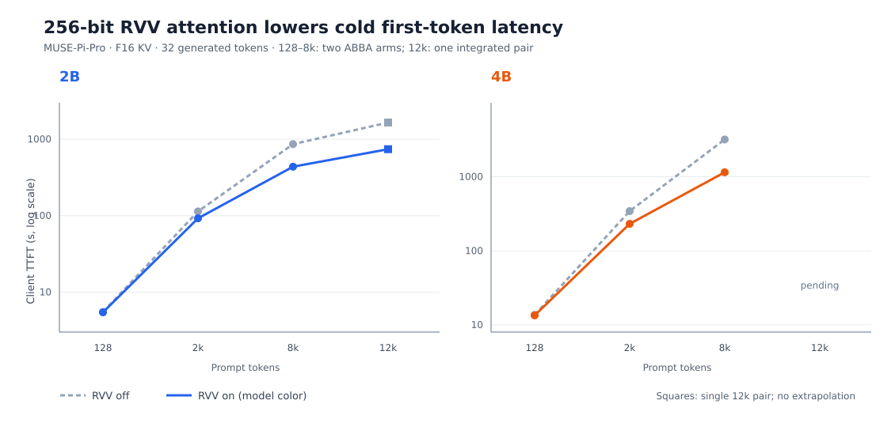

# Completed 2B/4B lifecycle gates on MUSE-Pi-Pro

Date: 2026-09-27. This updates the [lifecycle baseline](2026-09-25-lifecycle.md). The [requirements audit](2026-09-27-requirements-audit.md) maps each original checklist item to its proof and remaining gate. The board is the K1/X60 MUSE-Pi-Pro; models, fixed prompts, F16 K/V defaults, and client-observed TTFT are defined there. Unless stated otherwise, each comparison uses the same binary in off/on/on/off or partition/unified/unified/partition order. All numbers below are measured board results, not projections.

## Cold prefill: activated 256-bit RVV attention

The original wide-RVV experiment never activated: it required 128-byte vectors, while this X60 reports `vlenb=32`. The [256-bit tiled adaptation](../experiments/2026-09-26-wide-rvv-vlen256.patch) loops over every cell of the 64-cell QK tile. It is enabled with `SPINE_FA_WIDE_TILE=1` for 256-dimensional F16 K/V heads; short-tail and single-token decode retain the generic path. Both enabled server logs for each model contain the kernel activation marker. The [short](raw/2026-09-25-lifecycle/lifecycle-rvv32.jsonl) and [8k](raw/2026-09-25-lifecycle/lifecycle-rvv32-long.jsonl) campaigns passed exact token-count and token-hash audits across all off/on arms.

| Model | Prompt | TTFT off → on (s) | TTFT change | Prefill off → on (tok/s) | Peak RSS change |
| --- | ---: | ---: | ---: | ---: | ---: |
| 2B | 2,048 | 113.78 → 92.45 | −18.8% | 18.02 → 22.18 | ~0 MiB |
| 4B | 2,048 | 343.95 → 231.54 | −32.7% | 5.96 → 8.86 | ~0 MiB |
| 2B | 8,192 | 862.62 → 438.05 | −49.2% | 9.50 → 18.70 | ~0 MiB |
| 4B | 8,192 | 3,194.99 → 1,150.42 | −64.0% | 2.56 → 7.12 | ~0 MiB |

The [prefill curve](raw/2026-09-25-lifecycle/rvv-prefill.svg), generated by [plot-rvv-prefill.py](../bench/plot-rvv-prefill.py), shows measured client TTFT at 128, 2k, and 8k for both models and the completed single 12k pair for 2B. Its 4B 12k point is marked pending; square markers distinguish the single integrated pair from the replicated earlier arms.

Each table cell is the mean of two arms in off/on/on/off order. At 128 prompt tokens, TTFT changed only about 1% for 2B and 2% for 4B. The same source patch has been applied to the clean integrated board checkout at `a990751` and `llama-server` rebuilt successfully. The packaged optional `--rvv256` helper was also applied in a disposable clean `5ad05d8` worktree with all prior optional patches; the three CPU files matched the integrated board source byte-for-byte. An [integrated-build smoke run](raw/2026-09-25-lifecycle/lifecycle-integrated-rvv-smoke.jsonl) on both models confirmed activation and exact outputs against the isolated controls. The integrated runtime remains opt-in: set `SPINE_FA_WIDE_TILE=1` when serving these Qwen3.5 F16-KV models. Its measured benefit is cold prefill, particularly long prompts; it does not change the generic single-token decode path. These measurements do not establish a gain for quantized KV, other head shapes, or other models. The [same-integrated-binary 12k extension](raw/2026-09-25-lifecycle/lifecycle-integrated-rvv-12k.jsonl) now has a completed 2B off/on pair: client TTFT fell from 1,653.70 to 741.47 s (−55.2%), and prompt rate rose from 7.431 to 16.573 tok/s (+123.0%). Both requests returned all 32 tokens with identical token and text hashes; the enabled log confirms the RVV kernel ran. Peak RSS was 2,522.20 versus 2,522.48 MiB. This is one pair, so it extends the long-context result but does not have the run-order control of the 2k/8k ABBA campaigns. From 2k to 12k, 2B prefill rate fell 58.8% with the generic path versus 25.3% with RVV; this compares the ABBA 2k mean with the single 12k pair. For 4B, the measured 2k-to-8k rate decline was 57.0% generic versus 19.6% RVV. The 4B 12k off/on pair is still running.

A 4/6/8/2/4-thread [sweep](raw/2026-09-25-lifecycle/lifecycle-threads.jsonl) at 128 and 2,048 tokens completed 40 exact-output requests. Six or eight threads were neutral for 2B. At 4B/2k, eight threads reduced TTFT only ~0.8% versus the bracketed four-thread controls; two threads roughly doubled TTFT for both sizes. Four threads remain the supported default; only cores 0–3 advertise IME.

## Decode stability and speculative correctness

The [fixed C++ prompt](raw/2026-09-25-lifecycle/lifecycle-code-prompt.cpp) produced two complete 4,096-token requests in each direct and MTP mode for both models. Per-request wall times were ~16.6/10.5 minutes for 2B direct/MTP and ~43.2/28.1 minutes for 4B direct/MTP. No server error or early stop occurred. Decode-phase RSS drift was 1.5–3.8 MiB direct and 5.9–10.6 MiB MTP. The slowest streamed gap was 0.82 s direct and 3.95 s MTP; the MTP gap reflects batched speculative delivery. Decode throughput declined as the history grew, especially for 4B, but no multi-minute stall or runaway post-prefill RSS appeared in these measured requests. The [event-trace records](raw/2026-09-25-lifecycle/lifecycle-code-long.jsonl) permit 128-token-window inspection.

| Model | Direct decode | MTP decode | Draft acceptance | Output comparison |
| --- | ---: | ---: | ---: | --- |
| 2B | 4.14 tok/s | 6.53–6.57 tok/s | ~98.9% | Direct/MTP token hashes differ; each mode repeats exactly |
| 4B | 1.59 tok/s | 2.44–2.45 tok/s | ~98.9% | Direct/MTP token hashes differ; each mode repeats exactly |

The [strict audit](../bench/audit-lifecycle.py) rejects direct/MTP identity for this 4,096-token code workload. A [captured token-ID prefix sweep](raw/2026-09-25-lifecycle/lifecycle-code-divergence.jsonl) locates the first mismatch at zero-based generated index 179 for 2B (256-token request) and index 303 for 4B (512-token request); 4B still matches through a 256-token request. A [target-logit trace](../experiments/2026-09-27-spec-logits-trace.md) is queued after the current board campaign to distinguish close argmax choices from a larger target-state discrepancy. An [RS rollback sweep](raw/2026-09-25-lifecycle/run-code-rs.sh) is queued to check whether the alternative target-state restoration changes those same first mismatches. Therefore the higher MTP rate cannot be called lossless here. The earlier repeated synthetic 2,048-token requests did match exactly; that narrower result still holds. Direct remains the accuracy-preserving recommendation for arbitrary long code generation until the first divergence is located and fixed. These runs establish bounded multi-request stability over their observed durations, not indefinite service stability.

The [pinned-slot 4B concurrency ABBA](raw/2026-09-25-lifecycle/lifecycle-code-pinned.jsonl) completed 16 c4 and 32 c8 requests with exact direct/MTP token hashes at each physical slot; all slots produced one common hash in this pinned campaign. Mean aggregate throughput was 3.3258 direct versus 3.2283 MTP tok/s at c4 (MTP −2.9%) and 3.5253 versus 3.4415 at c8 (MTP −2.4%), with two rounds per mode/concurrency. The earlier automatic-assignment campaign had per-request output variants; explicit pinning removes that ambiguity for this fixed prompt and 128-token output length. Keep direct decoding for c4/c8 on the measured workload.

## Long-context and cache methods

The direct [128–12,288-token curves](2026-09-25-lifecycle.md) remain the baseline for both models, including measured RSS jitter and 8k/16k KV allocation overhead. The [same-build 12k full-history controls](raw/2026-09-25-lifecycle/lifecycle-windowed-control.jsonl) and [windowed MTP runs](raw/2026-09-25-lifecycle/lifecycle-windowed.jsonl) each returned 128 tokens with identical hashes. The 2,048-token draft window lowered peak RSS by 68.5 MiB for 2B and 135.3 MiB for 4B. Observed decode rates were 2.61 → 2.83 and 0.77 → 0.89 tok/s. TTFT was 1,857.5 → 1,709.1 s for 2B and 7,157.9 → 6,648.0 s for 4B. Each long arm was run once, in separate order even though the binary matched; the apparent speed gains need a repeated interleaved comparison before they can be attributed to the window. A [full/window/window/full 12k repeat](raw/2026-09-25-lifecycle/run-windowed-abba.sh) for both models is queued after the current board campaign. The draft-window patch is also packaged as optional `--windowed-mtp`; a [combined RVV+windowed K1 run](raw/2026-09-25-lifecycle/run-rvv-window-combined.sh) and clean-base all-options application check are queued after the correctness diagnostics. No combined-build performance result is claimed yet. Short same-binary full/window arms showed memory savings but no speed difference. Windowing affects draft history; target-model cold prefill still traverses the full prompt.

The repeated [4B F16/Q4_0 KV ABBA](raw/2026-09-25-lifecycle/lifecycle-4b-kv-abba.jsonl) completed at 128/2,048 prompts with exact F16/Q4_0 32-token outputs. At 2k, Q4_0 lowered TTFT from 340.25 to 299.09 s (−12.1%) and loaded RSS from 5,363.7 to 4,996.1 MiB (−367.6 MiB). The 2B initial Q4_0 test had a 2k TTFT regression. Q4_0 KV and the new RVV prefill kernel cannot be combined as measured: the latter dispatches only F16 K/V. For 4B cold-prefill speed, the measured RVV F16 result (231.54 s at 2k) is faster than Q4_0 without that kernel (299.09 s). Q4_0 remains a memory-saving option when RAM pressure matters; a queued 512-token-output F16/Q4_0 comparison will check longer-output token agreement. Its 8k speed under Q4_0 still needs separate evidence.

The [four-slot rotated scheduling ABBA](raw/2026-09-25-lifecycle/lifecycle-reuse-scheduling.jsonl) completed both models, with 32 outputs each and verified physical slot IDs. 2B unified KV averaged 1.8143 aggregate tok/s versus 1.8852 partitioned (−3.8%). 4B unified averaged 0.6991 versus 0.6948 (+0.6%, within a small run-order effect). At 4B/2k, partitioned mode's first round in each outer arm returned a different hash from its second round and from unified; the other prompt lengths matched. The campaign-specific auditor therefore correctly rejects a universal exact-output claim for 4B. Neither throughput nor correctness supports switching the default to unified KV.

The [occupied-page gather](../experiments/2026-09-26-page-gather.md) passed the board numerical test, 2B/4B smoke, and 64 completion/hash checks in its four-slot ABBA. Its aggregate throughput fell from 1.0998 to 1.0768 tok/s for 2B (−2.1%) and 0.4351 to 0.4223 for 4B (−2.9%); peak RSS increased about 2/5 MiB. A negative configuration test with `SPINE_KV_PAGE_GATHER=1` and no unified KV exited with the patch's explicit validation error, confirming the runtime flag is read. The server's default log verbosity omitted the physical/gathered-span telemetry, so the measured run does not prove how much attention span was compacted. The prototype keeps the full backing allocation and does not provide page allocation/reclamation or a direct page-index kernel. Do not adopt it for performance or call it full paged scheduling.

## Layered offload outcome and remaining work

The isolated OpenCL build and [0/4 GPU-layer ABBA](raw/2026-09-25-lifecycle/lifecycle-opencl.jsonl) completed with exact outputs, but **no layer was offloaded**. Every `-ngl 4` server log says `unsupported GPU 'PowerVR B-Series BXE-2-32'`, drops the device, and ignores `--gpu-layers`. Thus the nearly identical CPU timings are not GPU performance data. The fork's backend admits Adreno/Intel devices and requires OpenCL C 2.0; the board probe reported OpenCL C 1.2 for PowerVR and did not list the subgroup extensions used by this backend. The rejection therefore guards actual kernel and API incompatibilities, beyond the GPU-name check. Real layered GPU offloading requires a backend port or a different supported backend. It remains unimplemented on this board.

The remaining correctness work is to locate and fix the 4,096-token code-prompt MTP divergence, then repeat a long varied-prompt comparison. To adopt windowed MTP for speed, repeat matched 12k full/window runs. To complete paged scheduling, implement and test page allocation/reclamation and mapped attention that avoids the gather-copy penalty. To complete layered offloading, establish an actually supported GPU backend and measure transferred layers. The activated RVV F16 prefill kernel is the current measured performance improvement for both model sizes.
