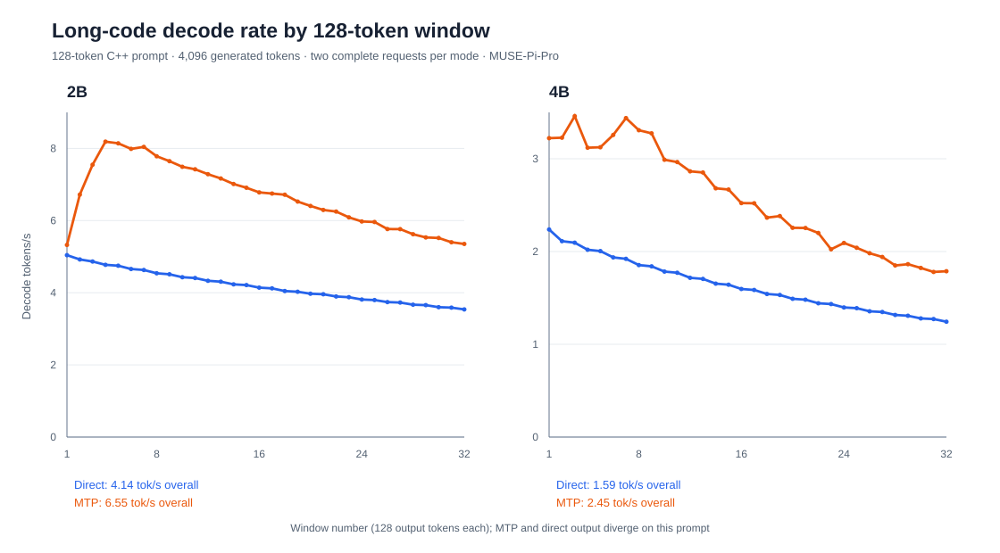

# Resumed MUSE-Pi-Pro measures

Run dates: 2026-09-27–28 (Asia/Singapore).

The 2026-09-27 board shutdown cleared `/tmp` and ended the previously queued wrappers. This report records only archived completed measurements and new runs started after the reboot. The restored run inputs and outputs live under `~/Projects/riscv-accl-bench-2026-09-27` on `musepipro-wg`.

## Compact baseline and optimized matrix

The isolated-build 2k/8k rows and integrated weight-format rows are means of two launches per arm. The integrated 12k/16k RVV comparisons have one launch per arm; the 32k row is a single optimized-arm feasibility run. Both model files are the local Qwen3.5 2B/4B MTP Q4_0 GGUFs, with Q4_0 **weights** and F16 **K/V**, served in direct mode. Both builds are SpacemiT llama.cpp at `a990751` plus the opt-in [256-bit RVV patch](../patches/0009-wide-rvv-vlen256.patch). `R` is the isolated `spacemit-llama-rvv32` build; `I` is the integrated `spacemit-llama-integrated` build. Settings: one stream, four threads, `-b 32 -ub 32 -fa on`, greedy seed 42, 32 outputs, no prompt cache. Context allocation is 4,096 for 2k and 16,384 for 8k/12k. `RVV=1` means `SPINE_FA_WIDE_TILE=1` and its activation marker was confirmed in the server log. Peak RSS is whole-process, not KV payload alone. `Exact` means complete outputs and one token/text hash per model and prompt length across off/on arms. End-to-end rate includes prefill.

| Model | Build | Prompt | RVV | TTFT s | Prefill tok/s | Decode tok/s | End-to-end tok/s | Peak RSS MiB | Output audit |
| --- | --- | ---: | ---: | ---: | ---: | ---: | ---: | ---: | --- |
| 2B | R | 2,048 | 0 | 113.78 | 18.02 | 4.33 | 0.264 | 2,435.0 | Exact |
| 2B | R | 2,048 | 1 | 92.45 | 22.18 | 4.33 | 0.321 | 2,435.1 | Exact |
| 4B | R | 2,048 | 0 | 343.95 | 5.96 | 1.66 | 0.088 | 5,241.6 | Exact |
| 4B | R | 2,048 | 1 | 231.54 | 8.86 | 1.66 | 0.128 | 5,241.8 | Exact |
| 2B | R | 8,192 | 0 | 862.62 | 9.50 | 2.71 | 0.037 | 2,521.4 | Exact |
| 2B | R | 8,192 | 1 | 438.05 | 18.70 | 2.72 | 0.071 | 2,521.4 | Exact |
| 4B | R | 8,192 | 0 | 3,194.99 | 2.56 | 0.88 | 0.010 | 5,471.1 | Exact |
| 4B | R | 8,192 | 1 | 1,150.42 | 7.12 | 0.89 | 0.027 | 5,471.0 | Exact |
| 2B | I | 12,288 | 0 | 1,653.70 | 7.43 | 2.35 | 0.019 | 2,522.2 | Exact; one pair |
| 2B | I | 12,288 | 1 | 741.47 | 16.57 | 2.35 | 0.042 | 2,522.5 | Exact; one pair |
| 4B | I | 12,288 | 0 | 6,568.42 | 1.87 | 0.62 | 0.0048 | 5,471.0 | Exact; one pair |
| 4B | I | 12,288 | 1 | 2,094.62 | 5.87 | 0.62 | 0.0149 | 5,471.1 | Exact; one pair |
| 2B | I | 16,384 actual prompt | 0 | 2,808.28 | 5.83 | 1.78 | 0.0113 | 2,571.5 | Exact; one pair |
| 2B | I | 16,384 actual prompt | 1 | 1,124.57 | 14.57 | 1.78 | 0.0280 | 2,571.8 | Exact; one pair |
| 4B | I | 16,384 actual prompt | 0 | 11,062.98 | 1.48 | 0.52 | 0.0029 | 5,600.2 | Exact; one pair |
| 4B | I | 16,384 actual prompt | 1 | 3,216.23 | 5.09 | 0.51 | 0.0098 | 5,600.3 | Exact; one pair |
| 2B | I | 32,768 actual prompt | 1 | 3,291.21 | 9.96 | 0.95 | 0.0096 | 2,768.4 | Complete; one arm |
| 2B | I | 2,048, Q4_0 weights | 1 | 92.79 | 22.07 | 3.27 | 0.31 | 2,238.1 | Exact; two launches |
| 2B | I | 2,048, Q8_0 weights | 1 | 116.42 | 17.60 | 1.67 | 0.24 | 4,033.1 | Exact; two launches |
| 4B | I | 2,048, Q4_0 weights | 1 | 240.67 | 8.51 | 1.23 | 0.12 | 4,908.8 | Exact; two launches |
| 4B | I | 2,048, Q8_0 weights | 1 | 351.95 | 5.82 | 0.78 | 0.08 | 8,919.2 | Exact; two launches |

Raw measurements: [2k](raw/2026-09-25-lifecycle/lifecycle-rvv32.jsonl), [8k](raw/2026-09-25-lifecycle/lifecycle-rvv32-long.jsonl), [2B 12k](raw/2026-09-25-lifecycle/lifecycle-integrated-rvv-12k.jsonl), and [4B 12k](raw/2026-09-25-lifecycle/lifecycle-integrated-4b-rvv-12k-resume.jsonl). The 4B 12k [RVV-off](raw/2026-09-25-lifecycle/4B-rvv32-integrated-12k-resume-0.log) and [RVV-on](raw/2026-09-25-lifecycle/4B-rvv32-integrated-12k-resume-1.log) server logs accompany the JSONL. The integrated pair returned the same complete 32-token hash with no server error. RVV cut client TTFT from **6,568.42 to 2,094.62 seconds (68.1%)** and raised prefill from **1.87 to 5.87 tok/s (3.14×)**. Peak RSS was effectively unchanged at 5,471 MiB; measured decode rates were 0.623 and 0.619 tok/s, so no decode benefit is claimed. This is one pair and needs replication before a precise effect estimate.

The prepared [real 16k board script](../bench/run-actual-16k-board.sh) checks available RAM, caps address space at 12 GiB and each arm at three hours, and strictly audits exact off/on output. Its 20,480-token allocation fits the 16,384-token prompt and 32-token output. The 2B actual 16k [RVV-off](raw/2026-09-25-lifecycle/2B-q4w-f16kv-16k-rvv0.jsonl) and [RVV-on](raw/2026-09-25-lifecycle/2B-q4w-f16kv-16k-rvv1.jsonl) runs both completed all 32 output tokens with the same token and text hashes. RVV cut client TTFT from **2,808.28 to 1,124.57 seconds (60.0%)** and raised prefill from **5.83 to 14.57 tok/s (2.50×)**. Peak RSS changed by only 0.24 MiB, and decode remained 1.78 tok/s in both arms. The [off](raw/2026-09-25-lifecycle/2B-q4w-f16kv-16k-rvv0.log) and [on](raw/2026-09-25-lifecycle/2B-q4w-f16kv-16k-rvv1.log) server logs are archived. This is one pair on a synthetic prompt. The 4B optimized 16k [request](raw/2026-09-25-lifecycle/4B-q4w-f16kv-16k-rvv1.jsonl) completed all 32 output tokens at 3,216.23 seconds client TTFT, 5.09 prompt tok/s, and 5,600.25 MiB peak RSS; its [server log](raw/2026-09-25-lifecycle/4B-q4w-f16kv-16k-rvv1.log) is archived. The [extended bounded baseline](../bench/run-4b-16k-baseline-extended-board.sh) with the same model, prompt, cache, batch, and threads and a five-hour cap completed at 11,062.98 seconds client TTFT ([request](raw/2026-09-25-lifecycle/4B-q4w-f16kv-16k-rvv0-extended.jsonl), [server log](raw/2026-09-25-lifecycle/4B-q4w-f16kv-16k-rvv0-extended.log)); its prefill alone ran about 3.07 hours, confirming that the original three-hour cap could not have finished it. The strict audit passes with one token and text hash across both arms, and the RVV-on log contains the kernel activation marker while the RVV-off log does not. RVV cut client TTFT from **11,062.98 to 3,216.23 seconds (70.9%)** and raised prefill from **1.48 to 5.09 tok/s (3.44×)**. Peak RSS was effectively unchanged at 5,600.2 versus 5,600.3 MiB, and measured decode rates were 0.516 and 0.515 tok/s, so no decode benefit is claimed. This is one pair and needs replication before a precise effect estimate.

The matched [Q4_0/Q8_0 weight comparison](raw/2026-09-25-lifecycle/lifecycle-weight-compare-2k.jsonl) used the integrated build with RVV wide attention enabled, F16 K/V, direct greedy decoding, 2,048 prompt tokens, 32 outputs, and an ABBA launch order for each model. The two launches per weight/model completed with identical 32-token hashes across **both weight formats** for each model; the eight server logs are archived beside the JSONL. The four bottom rows in the matrix are means of those two launches per arm and are separate from the earlier 2k isolated-build RVV comparison. Relative to Q4_0 weights, Q8_0 increased client TTFT by **25.5% for 2B** and **46.2% for 4B**, reduced decode throughput by **49.0%** and **36.5%**, and raised peak RSS by **1,795** and **4,010 MiB**. Q4_0 is the faster, lower-memory choice for this workload on this board. The matching short greedy hashes do not establish equal model quality; a Q8_0 long-context matrix is still unmeasured.

The bounded [2B actual 32k run](raw/2026-09-25-lifecycle/2B-q4w-f16kv-32768-rvv1-bounded.jsonl) completed its 32-token direct response with no server error. Its [server log](raw/2026-09-25-lifecycle/2B-q4w-f16kv-32768-rvv1-bounded.log) confirms the 256-bit RVV attention kernel activated. With Q4_0 weights, F16 K/V, 36,864 allocated context tokens, and the same four-thread, batch-32 integrated build, client TTFT was **3,291.21 s (54 min 51 s)**, prefill **9.96 tok/s**, decode **0.95 tok/s**, and total request wall time **3,324.97 s**. Loaded and peak RSS were **2,716.5/2,768.4 MiB**; decode-phase RSS drift was zero at the sampler's resolution. There was no swap or OOM. This establishes bounded 32k feasibility for 2B on one synthetic prompt, not a 32k optimization effect or long-document quality result. A matched RVV-off 32k baseline, 4B 32k, and 64k requests remain unmeasured. The nearly 55-minute cold TTFT makes prompt reuse or shorter input the practical next lever for interactive use.

## Extended decode cadence

The [128-token window curves](raw/2026-09-25-lifecycle/decode-windows.svg) use the complete [4,096-token code-prompt traces](raw/2026-09-25-lifecycle/lifecycle-code-long.jsonl): two requests per model and mode, 128 prompt tokens, F16 K/V, direct versus fixed MTP. Mean server decode rates are 4.14 direct versus 6.55 MTP tok/s for 2B, and 1.59 versus 2.45 for 4B. The plot shows how the rate changes across the 32 output windows. MTP and direct token IDs differ at generated index 179 (2B) and 303 (4B) on this prompt, so its higher rate is descriptive rather than a deployable exact-output optimization.

## MTP exactness diagnostics after restart

The completed [draft-length sweep](raw/2026-09-25-lifecycle/lifecycle-code-specmax.jsonl) changed `--spec-draft-n-max` from the default 3 to 1 and 2, using the same 128-token C++ prompt and captured token IDs. Both smaller draft lengths returned complete outputs, with the same MTP token hash within each model. Against the saved direct baseline, the first different generated token stayed at zero-based index **179 for 2B** (256 outputs) and **303 for 4B** (512 outputs). The completed [RS rollback sweep](raw/2026-09-25-lifecycle/lifecycle-code-rs.jsonl) set `SPINE_SPEC_RS=1` and also first differed at **179/303**. Neither shortening the draft nor changing rollback mode fixes the observed long-code mismatch. These are one run per diagnostic setting, with repeated first-difference positions across the earlier fixed-code runs; they do not prove the cause. The target-logit trace below narrows the mechanism.

| Model | Direct output length | Default MTP | Max draft 1 | Max draft 2 | RS rollback |
| --- | ---: | ---: | ---: | ---: | ---: |
| 2B | 256 | First difference 179 | 179 | 179 | 179 |
| 4B | 512 | First difference 303 | 303 | 303 | 303 |

### Target-logit trace

The [instrumented trace patch](../experiments/2026-09-27-spec-logits-trace.patch) rebuilt the same integrated server, recorded raw target-model top-two logits around each first mismatch, and was then removed; the original server binary rebuilt successfully. All four [traced completions](raw/2026-09-25-lifecycle/lifecycle-spec-logits-trace.jsonl) reproduced their saved uninstrumented token-ID arrays exactly. The full server logs are [2B direct](raw/2026-09-25-lifecycle/lifecycle-2B-plain-spec-logits-n256.log), [2B MTP](raw/2026-09-25-lifecycle/lifecycle-2B-mtp-spec-logits-n256.log), [4B direct](raw/2026-09-25-lifecycle/lifecycle-4B-plain-spec-logits-n512.log), and [4B MTP](raw/2026-09-25-lifecycle/lifecycle-4B-mtp-spec-logits-n512.log).

| Model | Generated index | Direct top two (logits) | Direct margin | MTP top two (logits) | MTP margin |
| --- | ---: | --- | ---: | --- | ---: |
| 2B | 179 | 745 (24.240017), 198 (24.170704) | 0.069313 | 198 (24.193840), 745 (24.190426) | 0.003414 |
| 4B | 303 | 35585 (20.548761), 723 (20.546551) | 0.002211 | 723 (20.549353), 35585 (20.487862) | 0.061491 |

Both paths rank the same two candidates at the first mismatch, in opposite order. This supports batch-dependent numerical sensitivity at these positions; it does not prove which kernel causes it or establish exactness for arbitrary inputs. Since one-token drafts and RS rollback preserved the mismatch, the practical exact-output setting remains direct decoding. A short flash-attention-off A/B is running to isolate that path further.

The [2B flash-attention-off diagnostic](raw/2026-09-25-lifecycle/lifecycle-code-fa-off.jsonl) completed 256 direct and MTP tokens with the same model, prompt, and batch settings but `-fa off`. Direct and MTP still diverged, now at generated index **99**. FA-off direct first differed from its FA-on direct control at index 99, and FA-off MTP first differed from FA-on MTP at 117. This setting changes the numerical output path and does not restore exact direct/MTP identity. It is one run per mode, so it isolates a failed workaround rather than a general causal attribution.

## Page-gather telemetry

The resumed [verbose four-slot page-gather run](raw/2026-09-25-lifecycle/lifecycle-page-gather-telemetry.jsonl) completed two rotated pinned-slot rounds, eight new 32-token responses. The [combined exact-output audit](raw/2026-09-25-lifecycle/lifecycle-page-gather.jsonl) checked 40 responses across 128/256/512/1,024-token prompts, with one token hash per prompt length and verified slot IDs. The [verbose log](raw/2026-09-25-lifecycle/lifecycle-2B-page-gather-telemetry.log) has 16 physical/gathered span records: **0/16 were compacted**. Median physical and gathered spans were both 1,152 rows (range 256–2,048). This confirms the flag activated but the tested occupancy did not reduce an attention span. The earlier 2–3% throughput loss and full backing allocation still argue against deploying this prototype as paged scheduling. A fragmented multi-slot workload and direct page-index attention remain unimplemented.

## 4B long-output KV format check

The resumed [4B 512-output pair](raw/2026-09-25-lifecycle/lifecycle-4b-kv-long.jsonl) used the same integrated binary, Q4_0 **weights**, 2,048 prompt tokens, 16,384 allocated context tokens, four threads, batch/microbatch 32, direct greedy decode, and RVV wide attention disabled in both arms. Only the **K/V cache format** changed, F16 versus Q4_0. Both returned all 512 tokens with identical token and text hashes; the first differing generated token is absent. Peak and loaded RSS include the whole process.

| K/V format | TTFT s | Prompt tok/s | Decode tok/s | Wall s | Loaded RSS MiB | Peak RSS MiB | VmSize MiB | Output |
| --- | ---: | ---: | ---: | ---: | ---: | ---: | ---: | --- |
| F16 | 351.45 | 5.827 | 1.172 | 788.50 | 5,363.73 | 5,470.36 | 6,790.11 | 512/512; exact hash |
| Q4_0 | 309.58 | 6.616 | 1.333 | 693.74 | 4,996.14 | 5,102.77 | 6,422.38 | 512/512; exact hash |

Q4_0 reduced client TTFT **11.9%**, total wall time **12.0%**, and peak RSS **367.59 MiB**; measured decode rate was **13.8% higher**. The earlier repeated 32-output 4B 2k comparison showed a similar TTFT and loaded-RSS effect. This 512-output comparison is one pair, so its decode speed difference remains provisional. It establishes exact greedy identity for this synthetic prompt and output length only; lossy KV quality on varied or longer prompts still needs separate assessment. The RVV F16 prefill kernel was not active here and currently cannot run with Q4_0 K/V.
A matched 512-output F16+RVV versus Q4_0 comparison is still needed to choose the fastest full-request setting when RAM is sufficient.
The four 128-token decode windows ranged from 1.15–1.19 tok/s with F16 and 1.32–1.35 tok/s with Q4_0; decode-phase RSS drift was only 0.25/0.125 MiB respectively. No stall, swap, or OOM was observed in this pair.

## Packaging and alternate GPU backend

A clean, disposable SpacemiT llama.cpp worktree at `5ad05d8` passed `apply-patches.sh --frspec --lowacc --q8-ime1 --m4-scale --rvv256 --windowed-mtp` and `git diff --check`. The worktree was removed after the check. The staged patch archive SHA-256 was `7670537de2c360acea0bcbd3ca0f6f6996efd36270e6cfa957b0f7b25e29c65a`. This validates patch application, not a combined RVV/windowed runtime performance claim.

The [board Vulkan probe](raw/2026-09-25-lifecycle/vulkaninfo-summary.txt) found a PowerVR B-Series BXE-2-32 MC1 device with Vulkan API 1.3.277 under temporary render-group access. The previously tested OpenCL backend transferred zero layers; Vulkan is a separate candidate. The board's official packages `glslc`, `libshaderc1`, and `spirv-headers` were installed without upgrading other packages. An [isolated Vulkan build](../bench/build-vulkan-board.sh) configured successfully and compiled 493 of 585 targets, then was stopped to free the board for the requested long-context CPU queue. On 2026-09-28 the Vulkan route was dropped as a project decision before any offload was demonstrated: the partial build directory was renamed aside (`build.dropped-20260928`) so the serial follow-up queue skips the build-resume and smoke steps, and its artifacts remain in the separate board worktree. The measured offload outcome on this board therefore stands at the OpenCL result: zero layers transferred, no GPU speed claim. A post-decision [driver audit](raw/2026-09-25-lifecycle/vulkaninfo-full.txt) supports the call: the PowerVR DDK 24.2@6603887 device reports `subgroupSize = 1`, 16 KiB compute shared memory, no `VK_EXT_memory_budget`, and a `maxStorageBufferRange` of 128 MiB, below the size of single quantized weight tensors in these models, so storage-buffer binding would have blocked layer offload even after a successful build.
